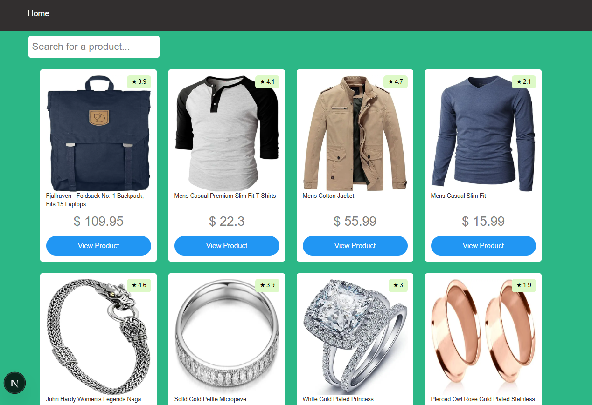
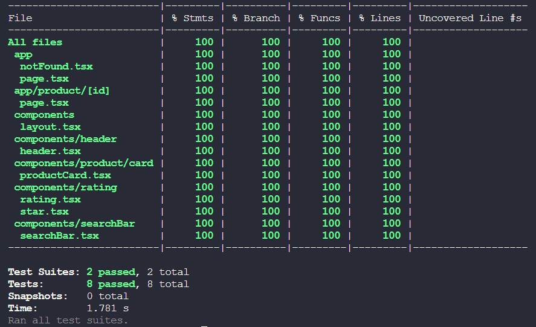

# POC | Next.js Ecommerce 

> Project preview


> Tests coverage


## 🚀 Installing and running the project

To install and run the project locally, follow these steps:

```
npm install
npm run dev
```

The project will be running at `http://localhost:3000/`

## 📝 Run tests

To run the unit tests

```
npm run test
```